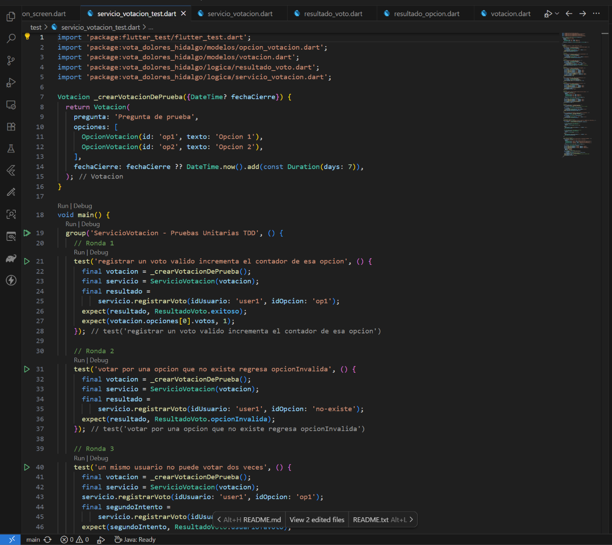
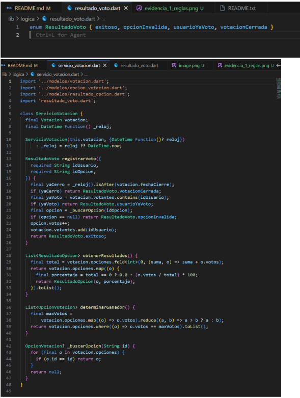
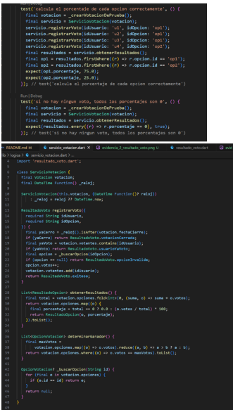
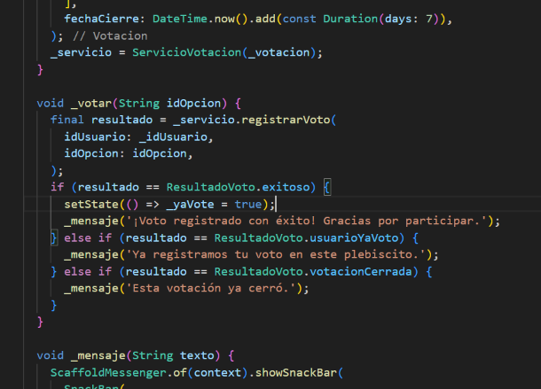
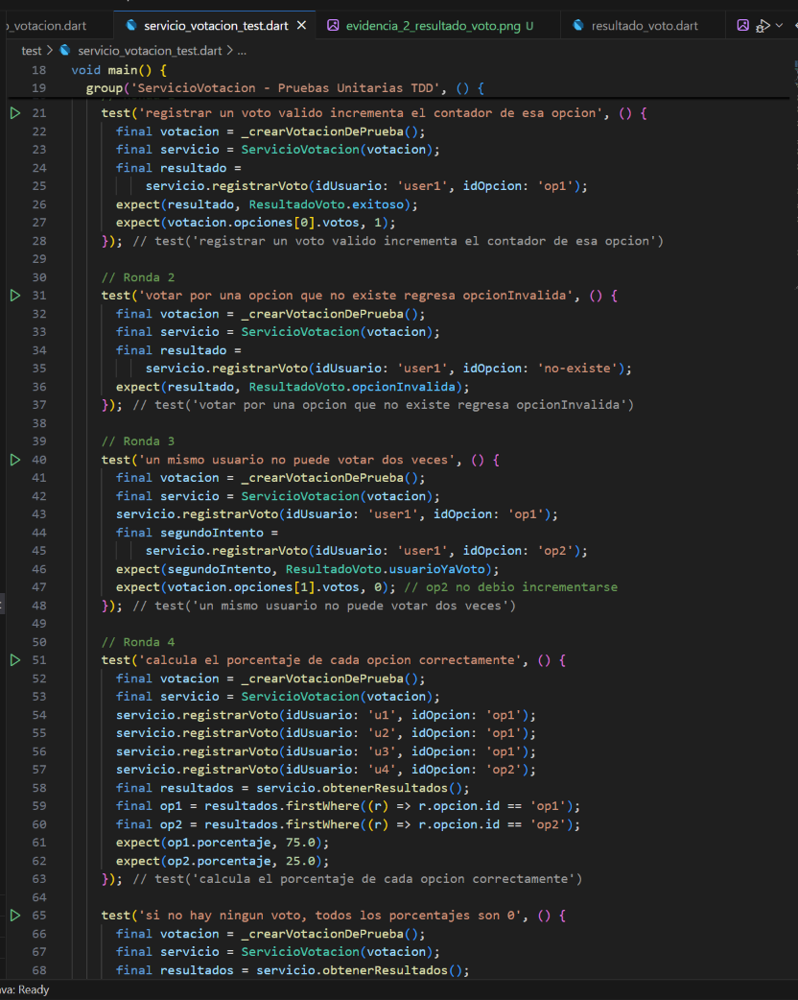

# Vota Dolores Hidalgo — Plebiscito Vecinal con TDD

Desarrollo Móvil Integral — Proyecto complementario de práctica TDD (Test-Driven Development).

---

## 7. Checklist de este proyecto TDD

| ✓ Verificación | 📸 Evidencia (Captura de Pantalla) |
| :--- | :---: |
| - [x] **Cada regla de negocio** (voto único, opción válida, fecha de cierre, empates) tiene su propia prueba. | <br><sub><em>Captura de las pruebas en <code>test/servicio_votacion_test.dart</code></em></sub> |
| - [x] **`ResultadoVoto` se usa para casos esperados;** no se abusa de excepciones para control de flujo normal. | <br><sub><em>Captura de <code>lib/logica/resultado_voto.dart</code> y <code>servicio_votacion.dart</code></em></sub> |
| - [x] **`obtenerResultados()` no puede dividir entre cero** cuando no hay votos. | <br><sub><em>Captura del método <code>obtenerResultados()</code> y su test</em></sub> |
| - [x] **La interfaz (`VotacionScreen`) no duplica ninguna regla** ya cubierta por `ServicioVotacion`. | <br><sub><em>Captura de <code>lib/presentation/votacion_screen.dart</code> delegando a <code>ServicioVotacion</code></em></sub> |
| - [x] **Existe una prueba de integración** que simula un plebiscito completo, incluyendo un intento de voto duplicado. | <br><sub><em>Captura de la prueba de integración y la terminal con <code>flutter test</code> en verde</em></sub> |

---

## 🚀 Ejecución del Proyecto

### Ejecutar todas las pruebas (TDD):
```bash
flutter test
```

### Ejecutar la aplicación:
```bash
flutter run
```