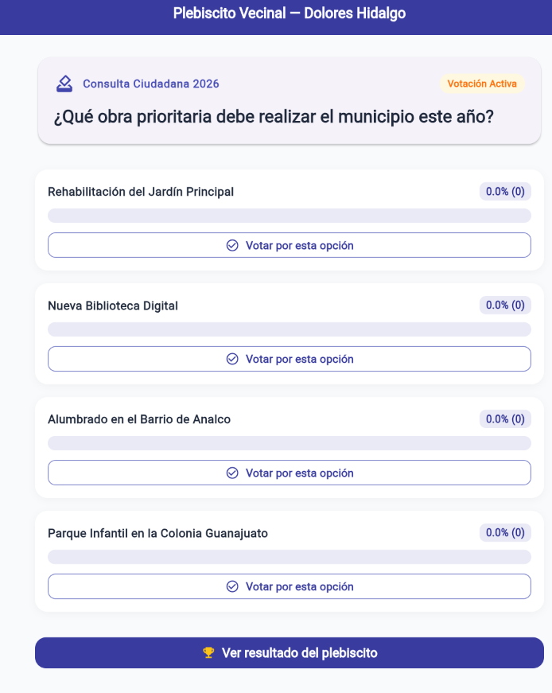
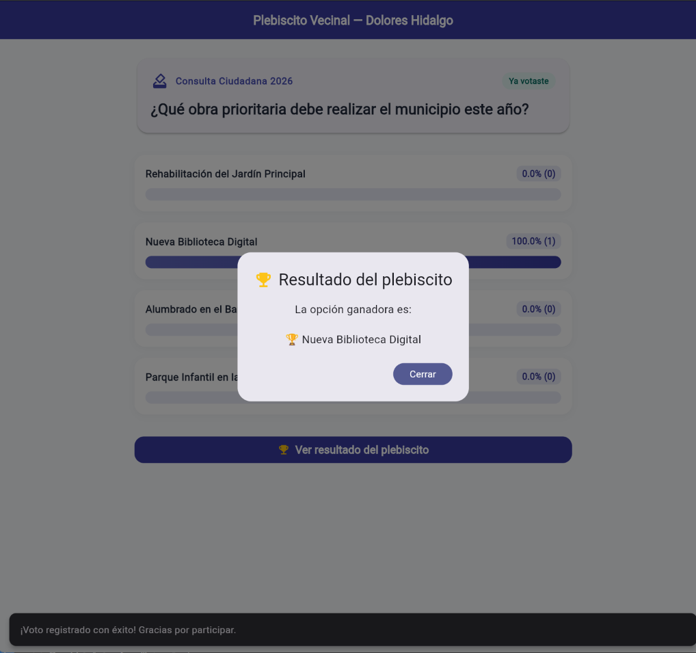

# Vota Dolores Hidalgo — Plebiscito Vecinal con TDD

Desarrollo Móvil Integral — Proyecto complementario de práctica TDD (Test-Driven Development).

---

## 7. Checklist de este proyecto TDD

| ✓ Verificación | 📸 Evidencia|
| :--- | :---: |
| - [x] **Cada regla de negocio** (voto único, opción válida, fecha de cierre, empates) tiene su propia prueba. |  |
| - [x] **`ResultadoVoto` se usa para casos esperados;** no se abusa de excepciones para control de flujo normal. | |
| - [x] **`obtenerResultados()` no puede dividir entre cero** cuando no hay votos. |  |
| - [x] **La interfaz (`VotacionScreen`) no duplica ninguna regla** ya cubierta por `ServicioVotacion`. |  |
| - [x] **Existe una prueba de integración** que simula un plebiscito completo, incluyendo un intento de voto duplicado. |  |

---





## 🚀 Ejecución del Proyecto

### Ejecutar todas las pruebas (TDD):
```bash
flutter test
```

### Ejecutar la aplicación:
```bash
flutter run
```